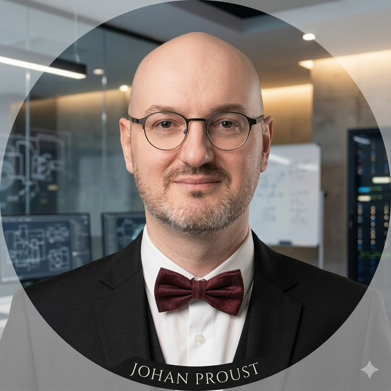

<html lang="fr">
<head>
    <meta charset="UTF-8">
    <meta name="viewport" content="width=device-width, initial-scale=1.0">
    <title>Johan Proust | Expert PMO Stratégique & AI Architecture</title>
    <meta name="description" content="PMO Senior & Consultant en Transformation Stratégique — Johan Proust. 13 ans d'expérience. Freelance disponible.">
    <meta name="robots" content="index, follow">
    <link rel="canonical" href="https://bobcat88.github.io/">
    <!-- Resource Hints -->
    <link rel="preconnect" href="https://fonts.googleapis.com">
    <link rel="preconnect" href="https://fonts.gstatic.com" crossorigin>
    <link rel="preconnect" href="https://cdnjs.cloudflare.com">
    <link rel="preconnect" href="https://unpkg.com">
    <!-- Meta balises pour réseaux sociaux (Open Graph) -->
    <meta property="og:type" content="website">
    <meta property="og:url" content="https://bobcat88.github.io/">
    <meta property="og:title" content="Johan Proust | Expert PMO Stratégique & AI Architecture">
    <meta property="og:description" content="Expert en pilotage de projets complexes, structuration stratégique et intégration d'agents IA. 13 ans d'expérience.">
    <meta property="og:image" content="johan-proust.webp">
    <!-- Meta balises pour Twitter -->
    <meta name="twitter:card" content="summary_large_image">
    <meta name="twitter:title" content="Johan Proust | Expert PMO Stratégique & AI Architecture">
    <meta name="twitter:description" content="Expert PMO Stratégique | Project Manager | AI Architect.">
    <meta name="twitter:image" content="johan-proust.webp">
    <link rel="icon" href="data:image/svg+xml,<svg xmlns=%22http://www.w3.org/2000/svg%22 viewBox=%220 0 100 100%22><text y=%22.9em%22 font-size=%2290%22>⚡</text></svg>">
    
    <link rel="stylesheet" href="https://cdnjs.cloudflare.com/ajax/libs/font-awesome/6.4.0/css/all.min.css">
    
    <link href="https://unpkg.com/aos@2.3.1/dist/aos.css" rel="stylesheet">
    
</head>
<body class="bg-slate-950 text-slate-100 leading-relaxed overflow-x-hidden">
    <main>
        <!-- Header / Hero -->
        <header class="relative min-h-screen flex items-center justify-center pt-20 pb-10 overflow-hidden">
            

            

            

        

        

            

                

                
            

            <h1 class="text-6xl md:text-8xl font-bold mb-6 tracking-tight">Johan Proust</h1>
            
            

                PMO Senior & Consultant en Transformation Stratégique
            

            

                Je structure ce qui est complexe.
                Je pilote ce qui est risqué.
                Je livre ce qui compte.
            

            

                <i class="fas fa-briefcase mr-2 text-blue-400"></i>13 ans d'expérience
                <i class="fas fa-globe-asia mr-2 text-purple-400"></i>7 ans en Asie
                <i class="fas fa-comment-dots mr-2 text-emerald-400"></i>Bilingue EN/FR
                <i class="fas fa-laptop-code mr-2 text-orange-400"></i>Hybride Tech/Biz
                <i class="fas fa-rocket mr-2 text-red-400"></i>Freelance disponible
            

            

                <a href="#experiences" class="px-8 py-4 bg-gradient-to-r from-blue-600 to-purple-600 hover:from-blue-500 hover:to-purple-500 text-white font-bold rounded-full transition-all shadow-lg shadow-blue-500/25">Découvrir mon parcours <i class="fas fa-arrow-right ml-2"></i></a>
                

                    <a href="https://www.linkedin.com/in/johan-proust/" target="_blank" class="text-slate-400 hover:text-blue-400 transition-colors" title="LinkedIn"><i class="fab fa-linkedin"></i></a>
                    <a href="https://wa.link/holzmf" target="_blank" class="text-slate-400 hover:text-green-400 transition-colors" title="WhatsApp"><i class="fab fa-whatsapp"></i></a>
                    <a href="javascript:void(0)" onclick="window.location.href='mailto:'+'johanproust'+'@'+'pm.me'" class="text-slate-400 hover:text-purple-400 transition-colors" title="Email"><i class="fas fa-envelope"></i></a>
                

            

            
            

                <a href="#expertise" class="text-slate-500 hover:text-white transition-colors">
                    <i class="fas fa-chevron-down text-2xl"></i>
                </a>
            

        

    </header>

    <!-- Expertise -->
    <section id="expertise" class="py-24 bg-slate-900/50">
        

            <h2 class="text-4xl font-bold mb-16 text-center">3 Piliers d'Expertise</h2>
            

                

                    

                        <i class="fas fa-project-diagram text-2xl text-blue-500"></i>
                    

                    <h3 class="text-xl font-bold mb-4">Pilotage de Portefeuilles & PMO</h3>
                    
Gouvernance, reporting COMEX/CODIR, risk management, planification multi-projets, suivi budgétaire >1Md€.

                    

                        Primavera P6MS ProjectQDV
                    

                

                

                    

                        <i class="fas fa-rocket text-2xl text-purple-500"></i>
                    

                    <h3 class="text-xl font-bold mb-4">Transformation & Product</h3>
                    
Cadrage amont, roadmap stratégique, gestion de backlog, MVP, méthodologie Design Thinking.

                    

                        Agile/ScrumProduct OwnerBusiness Analysis
                    

                

                

                    

                        <i class="fas fa-globe-asia text-2xl text-emerald-500"></i>
                    

                    <h3 class="text-xl font-bold mb-4">Biz Dev International</h3>
                    
Export strategy, négociation multiculturelle, management d'équipes transculturelles, 7 pays opérés en Asie-Pacifique.

                    

                        NégociationAsie-PacifiqueKPI/NPS
                    

                

            

        

    </section>

    <!-- Expériences -->
    <section id="experiences" class="py-24 bg-slate-900/30 relative">
        

            <h2 class="text-4xl font-bold mb-20 text-center">Parcours Professionnel</h2>       
            
              
                <!-- 0. Crédit Mutuel Arkéa -->
                

                    

                        Mar 2026 - Présent
                    

                    

                    

                        
Mar 2026 - Présent

                        <h3 class="text-2xl font-bold">Crédit Mutuel Arkéa</h3>
                        
PMO Stratégique - Dir. Développement

                        

                            Portfolio Management
                            Strategic Planning
                            Agile Hybrid
                            Stakeholder Coordination
                        

                        
Mission de structuration du pôle Support au Développement et pilotage du Plan de Développement stratégique (12-18 mois).

                        <a href="https://www.linkedin.com/in/johan-proust/" target="_blank" class="inline-block px-6 py-2 bg-red-600 hover:bg-red-700 text-white text-xs font-bold rounded-xl transition-all">
                            Détails Mission <i class="fab fa-linkedin ml-2"></i>
                        </a>
                    

                

                <!-- 1. NeoSoft -->
                

                    

                        Oct 2025 - Déc 2025
                    

                    

                    

                        
Oct 2025 - Déc 2025

                        <h3 class="text-2xl font-bold">NeoSoft</h3>
                        
Product Owner - Développement MVP

                        

                            Figma
                            Design Thinking
                            Agilité
                            Kanban
                        

                        
Cadrage amont et validation de concept (POC) pour sécuriser le développement.

                        <a href="https://docs.google.com/document/d/1xxzyoGqOU6SiQq8ci9xPORed7DPamUyGA2Xxg_xhwEA/edit?usp=drive_link" target="_blank" class="inline-block px-6 py-2 bg-blue-600 hover:bg-blue-700 text-white text-xs font-bold rounded-xl transition-all">
                            Détails Mission <i class="fas fa-external-link-alt ml-2"></i>
                        </a>
                    

                

                <!-- 2. Thales -->
                

                    

                        Oct 2024 - Oct 2025
                    

                    

                    

                        
Oct 2024 - Oct 2025

                        <h3 class="text-2xl font-bold">Thales ISR</h3>
                        
PMO & Support Bid Management

                        

                            QDV
                            Primavera P6
                            MS Project/Office
                            RiskX
                            VBA/Excel
                        

                        
Pilotage financier de +50 offres (>1Md€) et audit stratégique.

                        <a href="https://docs.google.com/document/d/13LURIzIYDEVGRZU5gprV16Lhpt4zj_yfUqO1joVTVhw/edit?usp=drive_link" target="_blank" class="inline-block px-6 py-2 bg-purple-600 hover:bg-purple-700 text-white text-xs font-bold rounded-xl transition-all">
                            Détails Mission <i class="fas fa-external-link-alt ml-2"></i>
                        </a>
                    

                

                <!-- 3. EPSI -->
                

                    

                        2024 (4 mois)
                    

                    

                    

                        
2024 (4 mois)

                        <h3 class="text-2xl font-bold">EPSI (Client Capgemini)</h3>
                        
Product Owner & Scrum Master

                        

                            Java/Spring
                            MySQL
                            Cybersecurity
                            Scrum
                        

                        
Pilotage de 2 équipes de dev pour un CRM sécurisé. Livraison 100% conforme.

                        <a href="https://docs.google.com/document/d/18pWjCAtyOMRExgEGMnvHBI772hxGsIZtfomSjvaS4t4/edit?usp=drive_link" target="_blank" class="inline-block px-6 py-2 bg-emerald-600 hover:bg-emerald-700 text-white text-xs font-bold rounded-xl transition-all">
                            Détails Mission <i class="fas fa-external-link-alt ml-2"></i>
                        </a>
                    

                

                <!-- 4. Gestion Locative -->
                

                    

                        2022 - 2023
                    

                    

                    

                        
2022 - 2023

                        <h3 class="text-2xl font-bold">Auto-Entrepreneur</h3>
                        
Project Manager - Logistique

                        

                            Asset Management
                            CRM
                            Notion
                            Gestion Prestaires
                        

                        
Optimisation du rendement (>90% d'occupation) et gestion opérationnelle.

                        <a href="https://docs.google.com/document/d/1ol-LDjmEQJhorYPO4kL01Zx-NNv1tXec8wUHrufqFgg/edit?usp=drive_link" target="_blank" class="inline-block px-6 py-2 bg-orange-600 hover:bg-orange-700 text-white text-xs font-bold rounded-xl transition-all">
                            Détails Mission <i class="fas fa-external-link-alt ml-2"></i>
                        </a>
                    

                

                <!-- 5. Sichuan Shuhan Plastics -->
                

                    

                        2015 - 2020
                    

                    

                    

                        
2015 - 2020

                        <h3 class="text-2xl font-bold">Sichuan Shuhan Plastics</h3>
                        
Resp. Développement Asie

                        

                            SAP Ariba
                            International Trade
                            YonYou CRM
                            Asian Market
                        

                        
Développement de l'export de 5% à 20% du CA (15M$), Management d'équipe.

                        <a href="https://docs.google.com/document/d/1YrwQRrBlTZ2I9lxNmwhOv0kSdqsAalw34sNbqmhaTbk/edit?usp=drive_link" target="_blank" class="inline-block px-6 py-2 bg-pink-600 hover:bg-pink-700 text-white text-xs font-bold rounded-xl transition-all">
                            Détails Mission <i class="fas fa-external-link-alt ml-2"></i>
                        </a>
                    

                

                <!-- 6. Vacorda Instruments -->
                

                    

                        2015 (6 mois)
                    

                    

                    

                        
2015 (6 mois)

                        <h3 class="text-2xl font-bold">Vacorda Instruments</h3>
                        
Stratégie Digitale & Biz Dev

                        

                            WIX
                            Google Ads and Analytics
                            SEO/SEA
                        

                        
Création de l'écosystème digital et développement zone francophone.

                        <a href="https://docs.google.com/document/d/1KIIt6meTpW7Xdh325C70he49OIoGGtHkd-nkTJciUzk/edit?usp=drive_link" target="_blank" class="inline-block px-6 py-2 bg-cyan-600 hover:bg-cyan-700 text-white text-xs font-bold rounded-xl transition-all">
                            Détails Mission <i class="fas fa-external-link-alt ml-2"></i>
                        </a>
                    

                

                <!-- 7. Diadom -->
                

                    

                        2012 - 2014
                    

                    

                    

                        
2012 - 2014

                        <h3 class="text-2xl font-bold">Diadom SAS</h3>
                        
Chef de Projet Digital / BA

                        

                            E-commerce
                            Drupal
                            Business Analysis
                            KPI/Reporting
                            HTML/CSS
                        

                        
Refonte e-commerce. Hausse du trafic de +196% et conversion +23%.

                        <a href="https://docs.google.com/document/d/1KIIt6meTpW7Xdh325C70he49OIoGGtHkd-nkTJciUzk/edit?usp=drive_link" target="_blank" class="inline-block px-6 py-2 bg-yellow-600 hover:bg-yellow-700 text-white text-xs font-bold rounded-xl transition-all">
                            Détails Mission <i class="fas fa-external-link-alt ml-2"></i>
                        </a>
                    

                

                <!-- 8. Justrade -->
                

                    

                        2011 - 2012
                    

                    

                    

                        
2011 - 2012

                        <h3 class="text-2xl font-bold">Justrade International</h3>
                        
Chargé de projet Webmarketing

                        

                            WordPress CMS
                            SEO/SEA
                            Photoshop
                            Logistique
                        

                        
Déploiement International : Adaptation de la plateforme digitale aux marchés étrangers.

                        <a href="https://docs.google.com/document/d/1JaOHl9brR_uOtd7ZPcN10GEvG5e1CPWp11Ufm67uctM/edit?usp=drive_link" target="_blank" class="inline-block px-6 py-2 bg-red-600 hover:bg-red-700 text-white text-xs font-bold rounded-xl transition-all">
                            Détails Mission <i class="fas fa-external-link-alt ml-2"></i>
                        </a>
                    

                

            

        

    </section>

    <!-- Metrics -->
    <section id="metrics" class="py-24 bg-blue-600/5">
        

            <h2 class="text-3xl font-bold mb-16 text-center">L'Impact en Chiffres</h2>
            

                

                    
> 1Md€

                    
Portefeuilles Pilotés

                

                

                    
+196%

                    
Trafic Digital (Diadom)

                

                

                    
15M$

                    
Expansion Export (Shuhan)

                

                

                    
25+

                    
Pays Traversés

                

            

        

    </section>
    <!-- Humanitaire & Formations -->
    <section class="py-24 bg-slate-950">
        

            

                <!-- Humanitaire & Loisirs -->
                

                    <h2 class="text-3xl font-bold mb-10"><i class="fas fa-heart text-red-500 mr-4"></i>Engagements & Loisirs</h2>
                    

                        

                            

                                <i class="fas fa-hand-holding-heart text-red-500"></i>
                            

                            

                                <h4 class="font-bold">Mission Humanitaire (Cambodge, Chine)</h4>
                                
Dons et Organisation logistique d'événements caritatifs

                            

                        

                        

                            

                                <i class="fas fa-microchip text-orange-500"></i>
                            

                            

                                <h4 class="font-bold">Veille Tech & IA</h4>
                                
Agents IA, automatisation, LLMs.

                            

                        

                        

                            

                                <i class="fas fa-plane text-blue-500"></i>
                            

                            

                                <h4 class="font-bold">Voyages (25 pays)</h4>
                                
7 ans d'expatriation en Asie.

                            

                        

                        

                            

                                <i class="fas fa-chart-line text-emerald-500"></i>
                            

                            

                                <h4 class="font-bold">Investissement & Finance</h4>
                                
Gestion d'un portefeuille familial (PnL +35%).

                            

                        

                    

                

                <!-- Formations -->
                

                    <h2 class="text-3xl font-bold mb-10"><i class="fas fa-graduation-cap text-blue-500 mr-4"></i>Formations & Certifs</h2>
                    

                        

                            

                                <i class="fas fa-shield-alt text-blue-500"></i>
                            

                            

                                <h4 class="font-bold">Développeur Cybersécurité (2024)</h4>
                                
EPSI - École d'ingénierie informatique

                            

                        

                        

                            

                                <i class="fas fa-tasks text-emerald-500"></i>
                            

                            

                                <h4 class="font-bold">Microsoft Project Management (2024)</h4>
                                
Certifié Gestion de Projet Industrielle & IT

                            

                        

                        

                            

                                <i class="fas fa-sync-alt text-purple-500"></i>
                            

                            

                                <h4 class="font-bold">Certified Agile Master (2023)</h4>
                                
Frameworks Scrum & Kanban

                            

                        

                        

                            

                                <i class="fas fa-university text-slate-500"></i>
                            

                            

                                <h4 class="font-bold">Master 2 Gestion de Projet IT & BI (2014)</h4>
                                
Montpellier Business School

                            

                        

                    

                

            

        

    </section>
    </main>
    <!-- Footer -->
    <footer class="py-20 border-t border-slate-900 text-center bg-slate-950">
        

            <h2 class="text-4xl font-bold mb-10">Me contacter</h2>
            

                <a href="javascript:void(0)" onclick="window.location.href='mailto:'+'johanproust'+'@'+'pm.me'" class="flex items-center gap-3 text-slate-400 hover:text-white transition-all">
                    <i class="fas fa-envelope text-2xl text-purple-500"></i> Johanproust@pm.me
                </a>
                <a href="https://wa.link/holzmf" class="flex items-center gap-3 text-slate-400 hover:text-white transition-all">
                    <i class="fab fa-whatsapp text-2xl text-green-500"></i> WhatsApp
                </a>
                <a href="https://www.linkedin.com/in/johan-proust/" class="flex items-center gap-3 text-slate-400 hover:text-white transition-all">
                    <i class="fab fa-linkedin text-2xl text-blue-500"></i> LinkedIn
                </a>
            

            
© 2026 Johan Proust — Portfolio Professionnel

        

    </footer>
    
</body>
</html>
